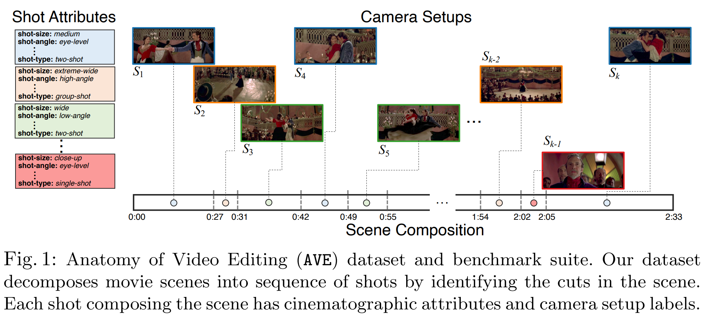

# The-Anatomy-of-Video-Editing
This is the official repository for our ECCV 2022 paper titled, "[The Anatomy of Video Editing: A Dataset and Benchmark Suite for AI-Assisted Video Editing](https://www.ecva.net/papers/eccv_2022/papers_ECCV/papers/136680195.pdf)".



## Getting Started
You can download all the labels in AVE using the following [link](https://drive.google.com/file/d/1b_4yO94UbkkUAiRo4TB6QLfNef4WQ3t-/view). The annotation file is organized as follows,

```json
{
  "**scene id** (ex. xBr1UV3kWqA)":
  {
    "*shot id* (ex. 02a91bd7-feda-4844-8a85-b01d43437140)":
    {
      "**clip-type**": ["shot"]
      "**start-time**": [51.05]
      "**end-time**": [62.15]
      "**shot-size**": ["medium"]
      "**shot-angle**": ["low-angle"]
      "**shot-type**": ["two-shot"]
      "**shot-motion**": ["handheld"]
      "**shot-subject**": ["human"]
      "**shot-location**": ["int"]
      "**num-people**": [2]
      "**sound-source**": ["on-screen"]
    }
  }
}
```
